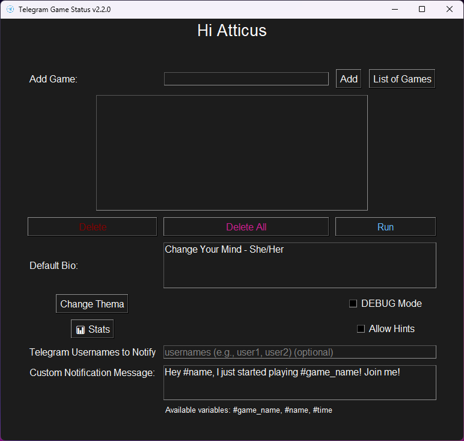
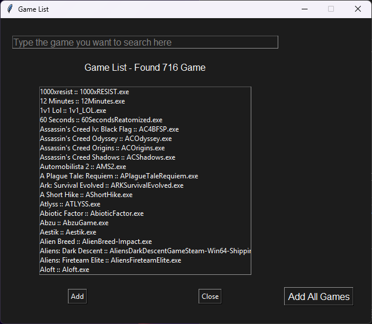
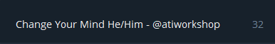

# Telegram Status (Game Activity Monitor)

[🇬🇧 English](README.md) // [🇹🇷 Türkçe](README.tr.md) 

## Description

Telegram Game Status is a Python application that monitors the games you're playing on your computer and automatically updates your Telegram profile status accordingly. With this app, you can showcase your gaming activity to your Telegram contacts, letting them know which game you're currently playing and for how long you've been playing it.


## Requirements

Firstly, clone the poject to your computer:

```bash
git clone https://github.com/phaticusthiccy/Telegram-Activity && cd ./Telegram-Activity
```

## 

The following libraries are required for the project to run:

- `asyncio`
- `psutil`
- `tkinter`
- `telethon`
- `python-dotenv`
- `pyinstaller`
- `pillow`
- `requests`

You can install these dependencies using the `requirements.txt` file:

```bash
pip install -r requirements.txt
```

## Environment Variables
To ensure the project runs correctly, you need to set certain environment variables. Copy the sample.env file to .env and fill in the required values:

The following environment variables are required for the application to function correctly:

``API_ID``: Your Telegram API ID, which is required for authenticating with the Telegram API.

``API_HASH``: Your Telegram API hash, which is also required for authentication.

``DEFAULT_BIO``: The default biography that will be set as your Telegram profile status when you're not playing any games.

⚠ Just edit these 3 variables! If you do not know the other variables, please do not change or delete them!

```bash
cp sample.env .env
```

After copying it, start the edit file with this command:

```bash
nano .env
```

## Usage
To run the GUI application, use the gui.py file:

> ```bash
> python gui.py
> ```
> or
> ```bash
> py gui.py
> ```


## Demo





### Before (When you close the game, your bio will be replaced with the default bio!) 



### After


## Contributing
If you want to contribute, please send a pull request or open an issue. Any contributions are welcome!

⚠ Note :: This project is still in development, so there might be some bugs. Please report them if you find any. Also if you wan to add more games to the game list use method below. Make changes, create pull request and I'll merge it if its ok!

```json
{
    "actual_process_name": ["real game name", "keyword 1", "keyword 2", "keyword n..", "actual_process_name"],
    "my_game.exe": ["My Awsome Game", "awsome game", "mygame", "my_game.exe"]
}
```

## License
This project is licensed under the [MIT License](LICENSE).