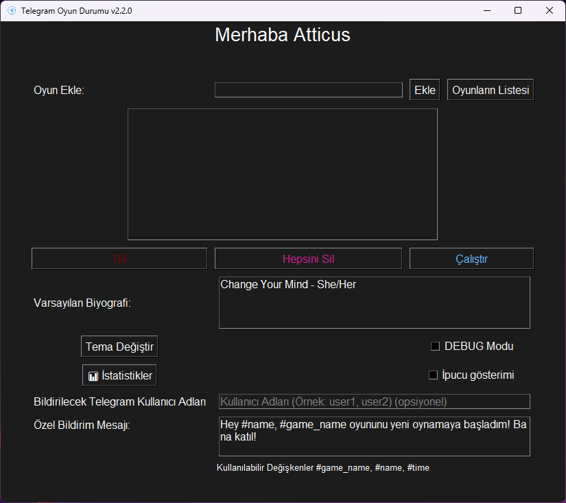
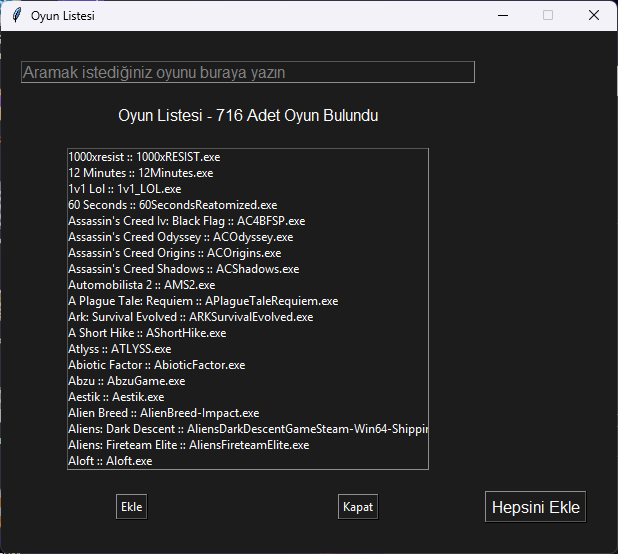
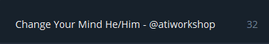
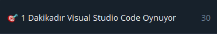

# Telegram Durumu (Oyun Etkinliği Monitörü)

[ English](README.md)

[ Türkçe](README.tr.md)

## Açıklama (Windows be Linux Destekler)

Telegram Oyun Durumu, bilgisayarınızda oynadığınız oyunları izleyen ve Telegram profil durumunuzu buna göre otomatik olarak güncelleyen bir Python uygulamasıdır. Bu uygulamayla oyun etkinliğinizi Telegram kişilerinize sergileyebilir, onlara şu anda hangi oyunu oynadığınızı ve ne kadar süredir oynadığınızı gösterebilirsiniz.

Toplamda 410 oyun desteklenmektedir! Oyunları görmek için [buraya (windows)](https://github.com/phaticusthiccy/Telegram-Activity/blob/master/games/games.csv) veya [buraya (linux)](https://github.com/phaticusthiccy/Telegram-Activity/blob/master/games/games_linux.csv) tıklayın!

## 1. Gereksinimler

Önce projeyi kendi bilgisayarınıza klonlayın:
```bash
git clone https://github.com/phaticusthiccy/Telegram-Activity && cd ./Telegram-Activity
```

## 

Projenin çalışması için aşağıdaki kütüphaneler gereklidir:

- `asyncio`
- `psutil`
- `tkinter`
- `telethon`
- `python-dotenv`
- `pillow`
- `requests`
- `sv_ttk`

Bu bağımlılıkları `requirements.txt` dosyasını kullanarak yükleyebilirsiniz:

```bash
pip install -r requirements.txt
```


## 2. Ortam Değişkenleri

Projenin doğru şekilde çalıştığından emin olmak için belirli ortam değişkenlerini ayarlamanız gerekir. sample.env dosyasını .env'e kopyalayın ve gerekli değerleri girin:

Uygulamanın düzgün çalışması için aşağıdaki ortam değişkenleri gereklidir:

``API_ID``: Telegram API'sinde kimlik doğrulaması yapmak için gerekli olan Telegram API kimliğiniz.

``API_HASH``: Kimlik doğrulama için de gerekli olan Telegram API HASH değeriniz.

``DEFAULT_BIO``: Herhangi bir oyun oynamadığınızda Telegram profil durumunuz olarak ayarlanacak varsayılan biyografi.

⚠ Sadece bu 3 değişkeni düzenleyin! Diğer değişkenleri bilmiyorsanız lütfen değiştirmeyin, silmeyin!

```bash
cp sample.tr.env .env
```

Kopyaladıktan sonra düzenleme dosyasını şu komutla başlatın:

```bash
nano .env
```

## 3. Kullanım
GUI uygulamasını çalıştırmak için gui.py dosyasını kullanın:

> ```bash
> python gui.py
> ```
> veya
> ```bash
> py gui.py
> ```

## Demo




### Önce (Oyunu kapattığınızda biyografiniz varsayılan biyografiyle değiştirilecektir!)



### Sonra




## Katkıda Bulunma
Katkıda bulunmak istiyorsanız lütfen pull request gönderin veya konu açın. Her türlü katkı memnuniyetle karşılanır!

> [Buraya tıklayarak yeni bir oyun için istek oluşturabilirsiniz!](https://github.com/phaticusthiccy/Telegram-Activity/issues/new?assignees=phaticusthiccy&labels=enhancement%2C+game+request&projects=&template=new-game-request.md&title=%5BREQUEST%5D+New+Game+Request)

⚠ Not :: Bu proje hala geliştirme aşamasında olduğundan bazı hatalar olabilir. Eğer bulursanız lütfen bunları bildirin. Ayrıca oyun listesine daha fazla oyun eklemek istiyorsanız aşağıdaki yöntemi kullanın. Değişiklik yapın, çekme isteği oluşturun ve sorun olmazsa birleştireceğim!

```json
{
    "asıl_program_ismi": ["Gerçek Oyun İsmi", "anahtar 1", "anahtar 2", "anahtar n..", "asıl_program_ismi"],
    "my_game.exe": ["Benim Harika Oyunum", "harika oyun", "benim oyunum", "my_game.exe"]
}
```

## Lisans
Bu proje [MIT Lisansı](LICENSE.tr.md) kapsamında lisanslanmıştır.

## Hızlı Başlatma (Window Masaüstü Kısayolu)
Projeyi çalıştırmak için her seferinde komut satırını açmanıza ve çok fazla kod girmenize gerek yok! [Buraya tıklayarak](https://github.com/phaticusthiccy/Telegram-Activity/wiki/Windows-Masa%C3%BCst%C3%BC-K%C4%B1sayolu-Nas%C4%B1l-Olu%C5%9Fturulur) masasütü kısayolunu oluşturmayı öğrenin!

## Hızlı Başlatma (Linux Masaüstü Kısayolu)
Projeyi çalıştırmak için her seferinde komut satırını açmanıza ve çok fazla kod girmenize gerek yok! [Buraya tıklayarak](https://github.com/phaticusthiccy/Telegram-Activity/wiki/Linux-Masa%C3%BCst%C3%BC-K%C4%B1sayolu-Nas%C4%B1l-Olu%C5%9Fturulur) masasütü kısayolunu oluşturmayı öğrenin!

## Sorun Giderme

Uygulamayı kullanırken herhangi bir sorunla karşılaşırsanız, aşağıdaki sorun giderme adımlarını deneyebilirsiniz:

### 1. Ortam Değişkenlerini Kontrol Edin
Gerekli ortam değişkenlerinin (`API_ID`, `API_HASH` ve `DEFAULT_BIO`) doğru şekilde ayarlandığından emin olun. Değerleri tekrar kontrol edin ve doğru olduklarından emin olun.

### 2. Telegram Bağlantısını Kontrol Edin
Aktif bir internet bağlantınız olduğundan ve Telegram sunucularına erişilebildiğinden emin olun. Bağlantınızı doğrulamak için başka bir Telegram kullanıcısına veya grubuna mesaj göndermeyi deneyebilirsiniz.

### 3. Oyun Listesini Kontrol Edin
Uygulamanın oynadığınız bir oyunu algılayamadığı durumlarda, oyunun `process_mapping.json` dosyasında bulunduğundan emin olun. Yoksa, "Katkıda Bulunma" bölümündeki talimatları izleyerek ekleyebilirsiniz.

### 4. İzinleri Kontrol Edin
Bazı sistemlerde, uygulamanın çalışan işlemleri izlemek için ek izinlere ihtiyacı olabilir. Uygulamayı yönetici ayrıcalıklarıyla çalıştırmayı deneyin.

### 5. Günlükleri Kontrol Edin
Uygulama, hataları ve uyarıları konsola kaydeder. Karşılaştığınız soruna ipucu verebilecek hata mesajları veya uyarılar olup olmadığını kontrol edin.

### 6. Bağımlılıkları Güncelleyin
Gerekli bağımlılıkların en son sürümlerinin yüklü olduğundan emin olun. Aşağıdaki komutu çalıştırarak bunları güncelleyebilirsiniz:

```bash
pip install -r requirements.txt --upgrade
```

### 7. Yüksek CPU Kullanımını Düzeltme
Uygulama çalıştırıldıkten sonra 10-30 saniye boyunca CPU kullanımı yüksek olabilir. Bu durum, uygulama oyunlarına erişim gerektiren bir şekilde çalıştığından oluşabilir. Endişelenmeyin!

Bu durum sadece geçicidir. 1 dakika içinde CPU kullanımı düşecektir. CPU tarafından sürekli yüksek bir kullanım durumu oluşursa, [buradaki adımları takip edin!](https://github.com/phaticusthiccy/Telegram-Activity/wiki/Y%C3%BCksek-CPU-Kullan%C4%B1m%C4%B1-%C3%87%C3%B6z%C3%BCm%C3%BC)