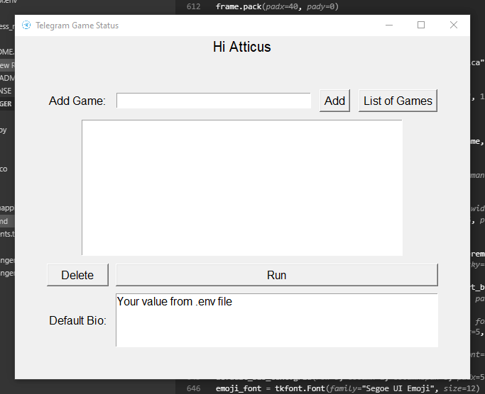
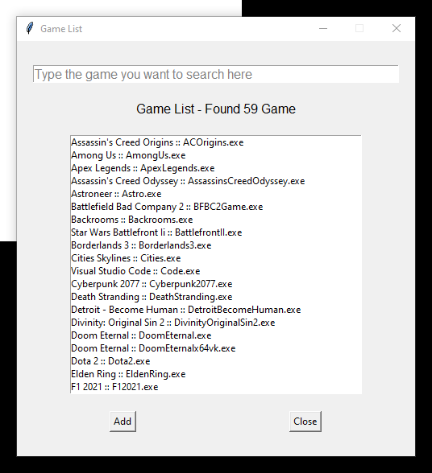
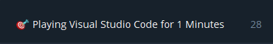

# Telegram Durumu (Oyun Etkinliği Monitörü)

[🇬🇧 English](README.md) // [🇹🇷 Türkçe](README.tr.md) 

## Açıklama

Telegram Oyun Durumu, bilgisayarınızda oynadığınız oyunları izleyen ve Telegram profil durumunuzu buna göre otomatik olarak güncelleyen bir Python uygulamasıdır. Bu uygulamayla oyun etkinliğinizi Telegram kişilerinize sergileyebilir, onlara şu anda hangi oyunu oynadığınızı ve ne kadar süredir oynadığınızı gösterebilirsiniz.

## Gereksinimler

Önce projeyi kendi bilgisayarınıza klonlayın:
```bash
git clone https://github.com/phaticusthiccy/Telegram-Activity && cd ./Telegram-Activity
```

## 

Projenin çalışması için aşağıdaki kütüphaneler gereklidir:

- `asyncio`
- `psutil`
- `tkinter`
- `telethon`
- `python-dotenv`
- `pyinstaller`
- `pillow`

Bu bağımlılıkları `requirements.txt` dosyasını kullanarak yükleyebilirsiniz:

```bash
pip install -r requirements.txt
```


## Ortam Değişkenleri

Projenin doğru şekilde çalıştığından emin olmak için belirli ortam değişkenlerini ayarlamanız gerekir. sample.env dosyasını .env'e kopyalayın ve gerekli değerleri girin:

Uygulamanın düzgün çalışması için aşağıdaki ortam değişkenleri gereklidir:

``API_ID``: Telegram API'sinde kimlik doğrulaması yapmak için gerekli olan Telegram API kimliğiniz.

``API_HASH``: Kimlik doğrulama için de gerekli olan Telegram API HASH değeriniz.

``DEFAULT_BIO``: Herhangi bir oyun oynamadığınızda Telegram profil durumunuz olarak ayarlanacak varsayılan biyografi.

⚠ Sadece bu 3 değişkeni düzenleyin! Diğer değişkenleri bilmiyorsanız lütfen değiştirmeyin, silmeyin!

```bash
cp sample.tr.env .env
```

Kopyaladıktan sonra düzenleme dosyasını şu komutla başlatın:

```bash
nano .env
```

## Kullanım
GUI uygulamasını çalıştırmak için gui.py dosyasını kullanın:

> ```bash
> python gui.py
> ```
> veya
> ```bash
> py gui.py
> ```

## Demo




### Önce (Oyunu kapattığınızda biyografiniz varsayılan biyografiyle değiştirilecektir!)


### Sonra




## Katkı
Katkıda bulunmak istiyorsanız lütfen pull request gönderin veya konu açın. Her türlü katkı memnuniyetle karşılanır!

⚠ Not :: Bu proje hala geliştirme aşamasında olduğundan bazı hatalar olabilir. Eğer bulursanız lütfen bunları bildirin. Ayrıca oyun listesine daha fazla oyun eklemek istiyorsanız aşağıdaki yöntemi kullanın. Değişiklik yapın, çekme isteği oluşturun ve sorun olmazsa birleştireceğim!

```json
{
    "asıl_program_ismi": ["Gerçek Oyun İsmi", "anahtar 1", "anahtar 2", "anahtar n..", "asıl_program_ismi"],
    "my_game.exe": ["Benim Harika Oyunum", "harika oyun", "benim oyunum", "my_game.exe"]
}
```

## Lisans
Bu proje [MIT Lisansı](LICENSE.tr.md) kapsamında lisanslanmıştır.